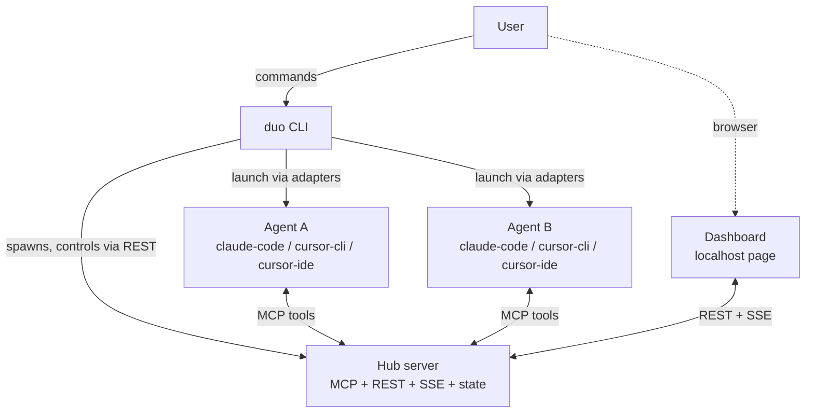

# Target Architecture — Overview

> The complete future architecture: one CLI, one hub, adapters per AI, a shared task board,
> and an optional local dashboard. Zero editor extensions, zero API keys.

## The system in one picture

```
                       ┌────────────────────────────┐
        you ──────────►│   duo  (single CLI)        │
                       │   init · start · plan      │
                       │   approve · status ·       │
                       │   feedback · stop · doctor │
                       └─────────────┬──────────────┘
                                     │ spawns & owns
                       ┌─────────────▼──────────────┐
                       │      HUB SERVER :3131      │
                       │  MCP (streamable HTTP)     │
                       │  REST + SSE events         │
                       │  session state + task board│
                       │  dashboard (static page)   │
                       └──────┬──────────────┬──────┘
                     adapter A│              │adapter B
              ┌───────────────▼───┐     ┌────▼──────────────┐
              │  claude -p "…"    │     │  cursor-agent -p  │
              │  (Claude Code)    │     │  (Cursor CLI)     │
              │  workspace A      │     │  workspace B      │
              └───────────────────┘     └───────────────────┘

              or, per slot: Cursor IDE adapter → kickoff prompt
              copied to clipboard, user pastes once (fallback)
```



## The five components

| Component | What it is | Document |
|---|---|---|
| **`duo` CLI** | The only thing the user touches. Configures sessions, spawns the hub, launches agents through adapters, surfaces approvals. | [03-core-concepts/cli.md](../03-core-concepts/cli.md) |
| **Hub server** | Standalone local process. Owns all session state (task board, contracts, checkpoints, logs). Speaks MCP to agents, REST/SSE to the CLI and dashboard. **The single source of truth.** | [02-standalone-hub.md](02-standalone-hub.md) |
| **Adapters** | One thin module per AI runner. Knows how to configure MCP for that AI and how to launch it with a kickoff prompt. | [04-adapter-architecture.md](04-adapter-architecture.md) |
| **Agents** | The AI coding agents themselves. Each is bound to one workspace and one role, and coordinates exclusively through hub MCP tools. | [03-core-concepts/agent.md](../03-core-concepts/agent.md) |
| **Dashboard** | Optional static page served by the hub at `http://localhost:3131`. Live logs, board view, approve buttons. Comfort, not capability — the CLI can do everything. | [03-core-concepts/dashboard.md](../03-core-concepts/dashboard.md) |

## A session, end to end

```
duo start "Add Google OAuth login"
  1. CLI loads config (workspaces, runners, roles — from `duo init`)
  2. CLI scans each workspace (regex project map, zero tokens)
  3. CLI spawns the hub (or reuses a running one)
  4. CLI writes MCP config into each workspace (.mcp.json / .cursor/mcp.json)
  5. Adapters launch each agent with its kickoff prompt — SAME process lives
     through planning AND execution
  6. PLANNING: agents explore, post a proposed task breakdown (post_plan),
     then block on await_plan_approval
  7. duo plan → you review the merged board; duo approve [--edit]
  8. EXECUTING: agents claim board items, post contracts, log updates,
     pause at checkpoints (duo feedback / duo approve)
  9. DONE: hub accepts completion only when every board item is done or
     explicitly marked out of scope
 10. duo stop → agents terminated, session archived
```

Full lifecycle detail: [03-core-concepts/session-lifecycle.md](../03-core-concepts/session-lifecycle.md).

## The six architectural decisions

Each has its own document in this folder:

1. [Standalone hub](02-standalone-hub.md) — the server moves out of the editor and becomes the source of truth.
2. [MCP transport upgrade](03-mcp-transport-upgrade.md) — streamable HTTP via the official SDK, legacy SSE kept for compatibility.
3. [Adapter architecture](04-adapter-architecture.md) — per-AI launch/config isolated behind a tiny interface.
4. [Task board model](05-task-board-model.md) — `taskA`/`taskB` replaced by a claimable, completable board.
5. [Planning protocol](06-planning-protocol.md) — plan → approve → execute, with the plan authored by the agents.
6. [Long-lived agent sessions](07-long-lived-sessions.md) — one process spans planning and execution; no context loss, no double scans.

## Hard constraints (inherited, non-negotiable)

- **Zero API keys.** The orchestrator (CLI + hub) never calls an LLM. Intelligence comes from the
  agents; the orchestrator provides structure, state, and gates.
- **Local-only.** The hub binds to `127.0.0.1`. Nothing leaves the machine.
- **Workspace boundary.** An agent writes only inside its own workspace. The filesystem is the
  hard isolation line; roles are soft biases.
- **Human gates.** Plan approval and checkpoints are user decisions surfaced in the CLI/dashboard —
  never auto-approved by default (except the documented trivial-plan fast path, which is
  configurable off).

## What is explicitly out of scope (for now)

- A native desktop application (Electron/Tauri) — the localhost dashboard covers the need;
  see [04-strategies-and-design-principles/extension-vs-cli-decision.md](../04-strategies-and-design-principles/extension-vs-cli-decision.md).
- Remote/multi-machine sessions.
- More than one concurrent session per machine (single session keeps v1 state simple).
- Windows support (macOS + Linux first).
