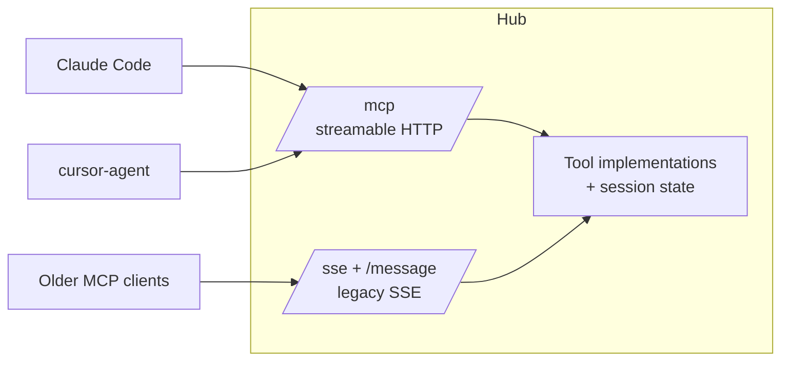

# Decision: MCP Transport Upgrade

> Move from hand-rolled JSON-RPC over the deprecated HTTP+SSE transport to the official
> MCP SDK with the **streamable HTTP** transport. Keep legacy SSE as a compatibility fallback.

## Current transport (what we have)

Generation 1 implements MCP by hand in `src/mcpServer.ts`:

- **Transport:** the legacy "HTTP+SSE" scheme from MCP spec `2024-11-05` — client opens
  `GET /sse`, receives an `endpoint` event pointing at `POST /message?clientId=N`, sends
  JSON-RPC there, and reads responses back **over the SSE stream** (the POST returns `202`).
- **Protocol handling:** hand-written dispatch for `initialize`, `tools/list`, `tools/call`;
  tool schemas hand-maintained in `src/mcpToolCatalog.ts`.

Generation 2 (Conductor) uses **stdio** — which structurally forces one server instance per
editor process and is rejected for that reason
(see [01-current-state/03-conductor-prototype.md](../01-current-state/03-conductor-prototype.md)).

## Target transport (what we build)

- **Primary: streamable HTTP** at `POST/GET /mcp` — the current MCP standard transport.
  Single endpoint, plain HTTP request/response with optional SSE upgrade for streaming;
  session management via the `Mcp-Session-Id` header.
- **Implementation: the official `@modelcontextprotocol/sdk`** (TypeScript), not hand-rolled
  JSON-RPC. Tool definitions become typed handlers with schemas generated from code.
- **Compatibility: keep `GET /sse` + `POST /message`** (the existing hand-rolled legacy layer,
  ported as-is) for any client that hasn't adopted streamable HTTP yet. Both transports front
  the same tool implementations.

## Why the upgrade is needed

1. **Multi-client compatibility is the whole point of this project.** We are moving from one
   known client (Cursor IDE, 2025-era) to a matrix of clients (Claude Code, cursor-agent,
   Cursor IDE, future CLIs). Targeting the current spec transport through the official SDK is
   how we avoid debugging per-client protocol quirks in code we wrote ourselves.
2. **The legacy SSE transport is deprecated.** New MCP clients may not implement it at all;
   building the future system on it would bake in obsolescence on day one.
3. **Hand-rolled JSON-RPC is liability code.** Spec evolution (protocol version negotiation,
   capabilities, notifications, session semantics) becomes an SDK upgrade instead of a
   re-implementation. The hand-rolled layer already skips parts of the spec (e.g. it only
   handles three methods).
4. **Streamable HTTP fits the hub model.** One endpoint, stateless-friendly, works through the
   same Node `http` server that serves REST and the dashboard — no separate connection
   choreography like the endpoint-announcement dance in the legacy transport.

## Why not stdio for the new hub

Stdio means the *client* spawns the server. With multiple agents in multiple processes, that
yields multiple servers and no shared authority — exactly Conductor's dead end. The hub must be
one process that many clients connect to; that is an HTTP property.

## Migration mechanics

- Tool implementations are extracted from `src/mcpServer.ts` `callTool()` into transport-agnostic
  functions (phase 1). Both transports call the same functions.
- Client config written by the CLI (see [04-adapter-architecture.md](04-adapter-architecture.md)):
  - Claude Code → `.mcp.json`: `{ "mcpServers": { "duo": { "type": "http", "url": "http://127.0.0.1:3131/mcp" } } }`
  - Cursor → `.cursor/mcp.json`: `{ "mcpServers": { "duo": { "url": "http://127.0.0.1:3131/mcp" } } }`
    (falls back to the `/sse` URL if a given Cursor version misbehaves on streamable HTTP —
    this is a one-line config difference isolated inside the Cursor adapters)
- The `/api/*` REST surface and `/api/updates` SSE event stream are **not MCP** and are
  unaffected by this decision.

## Risks

| Risk | Mitigation |
|---|---|
| A client's streamable-HTTP support is buggy | Legacy `/sse` fallback is kept working and selectable per adapter |
| SDK behavior differs from hand-rolled behavior agents were prompted around | Fake-agent integration tests pin tool-call semantics before real agents run ([04-strategies-and-design-principles/testing-strategy.md](../04-strategies-and-design-principles/testing-strategy.md)) |
