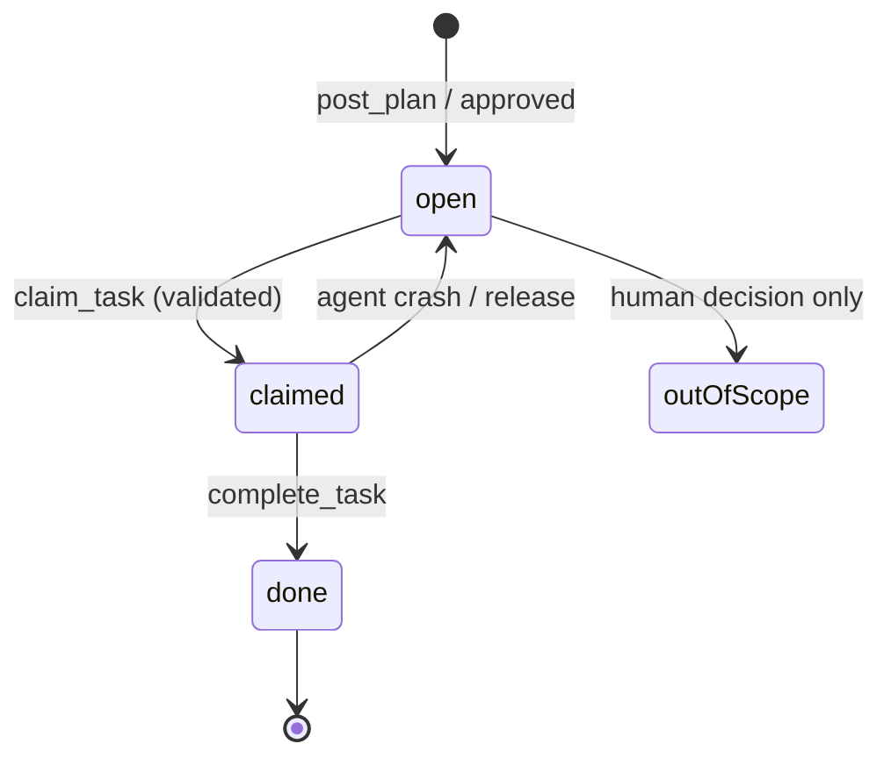

# Decision: Task Board Model

> `taskA` / `taskB` — two static strings — is replaced by a hub-owned **task board**:
> a list of work items that agents propose, claim, complete, and that the human can edit.
> The board is what makes flexible role splits, dropped-work detection, and N agents possible.

## Why taskA/taskB is replaced

The two-string model has three structural failures:

1. **It bakes in the split.** Whatever division the preset guessed at start is final. Real goals
   ("Add Google OAuth login") also need env vars, DB migrations, deployment changes — pieces that
   belong to neither string and are silently dropped.
2. **It bakes in the pair.** `Record<"A" | "B", Task>` appears in state, tool schemas, REST
   payloads, and UI. A third agent is a rewrite.
3. **It has no completion semantics.** "Both agents said they're done" is the only end condition —
   nothing verifies the *goal* is covered.

## The model

```ts
interface BoardItem {
  id: string;                 // "t1", "t2", …
  title: string;              // one line, imperative: "Add /auth/google callback route"
  ownerHint: string | null;   // suggested owner (agent id) from the plan; null = unassigned
  claimedBy: string | null;   // agent that actually claimed it
  paths: string[];            // files/dirs it touches (workspace-relative)
  status: "open" | "claimed" | "done" | "out-of-scope";
  refs: string[];             // filled at completion: what to look at
  version: number;            // monotonic board version at last change (for delta reads)
}
```

The board lives **only in the hub** (persisted with the session). Agents interact through tools:

| Tool | Semantics |
|---|---|
| `post_plan(agent_id, items[])` | Propose items during planning (see [06-planning-protocol.md](06-planning-protocol.md)) |
| `get_board(since_version?)` | Read the board — or only items changed since a version (delta) |
| `claim_task(agent_id, task_id)` | Take ownership. Hub validates the claim (rules below) |
| `complete_task(agent_id, task_id, refs?)` | Mark done, leaving file pointers for the peer |

## Ownership and claim rules

- **Claims are validated by workspace.** An item whose `paths` fall in workspace A can only be
  claimed by the agent bound to workspace A. The filesystem stays the hard boundary
  ([03-core-concepts/workspaces.md](../03-core-concepts/workspaces.md)); roles are soft biases
  used as `ownerHint`.
- **One claimant per item.** A claimed item is invisible to `claim_task` from others — no
  duplicate work.
- **Items with no clear workspace** (env vars on a deploy platform, shared docs) stay
  `ownerHint: null` until the plan-approval step, where the human assigns them — the explicit
  answer to cross-cutting work falling through cracks.

## Status tracking and the completion rule



**The hub refuses session completion while any item is `open` or `claimed`.** An agent that
believes it's finished must either complete its remaining claims or ask (via checkpoint) for
items to be marked out of scope — a status only the human can set. Combined with the kickoff's
final instruction ("before declaring done, re-read the board and the original goal; post anything
missing"), dropped work becomes a visible row, never a silent omission.

## Multi-agent scalability

The board is naturally N-agent: agents are a list, claims are per-item, and adding an agent adds
a claimant — no schema change. The v1 CLI restricts sessions to two agents (UX and testing
scope), but the hub, tools, and state model make no such assumption. See
[04-strategies-and-design-principles/scalability-strategy.md](../04-strategies-and-design-principles/scalability-strategy.md).

## The board in `--no-plan` mode

Skipping the plan phase doesn't remove the board — the CLI pre-fills it with one item per agent
generated from the preset split (the old v1 behavior, expressed in the new model). Completion
tracking and claims work identically. See
[06-planning-protocol.md](06-planning-protocol.md#skipping-the-plan---no-plan).

## Relationship to contracts

Board items say **what work exists and who owns it**. Contracts say **what interfaces the work
produces** ([03-core-concepts/contracts.md](../03-core-concepts/contracts.md)). An agent
completing "Implement auth API" posts a contract with the endpoint shapes and completes the item
with `refs` pointing at the implementation. The two systems stay separate on purpose: boards
change constantly, contracts must be stable reference points.
