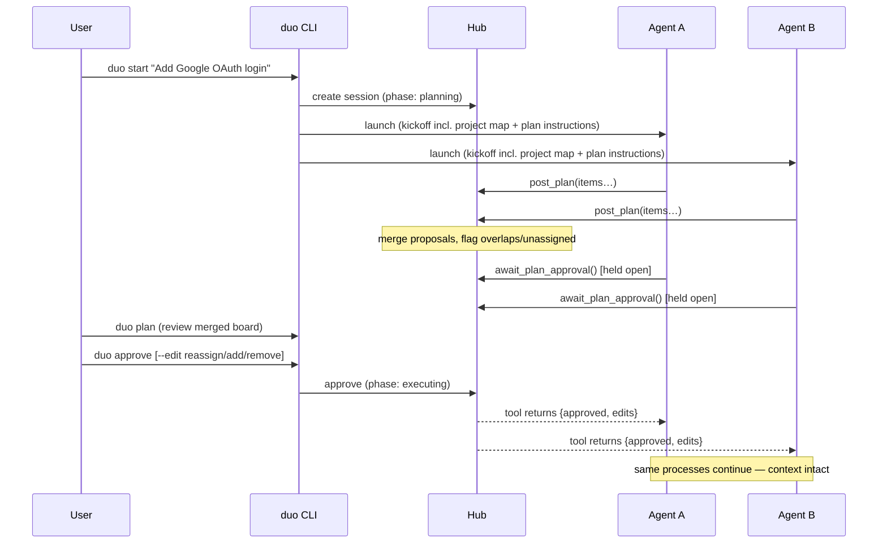

# Decision: Planning Protocol (Plan → Approve → Execute)

> Work division is decided by the agents after they've looked at the code — not guessed by a
> template before any LLM has seen the task. A human approves the plan before execution starts.

## Why agents should plan before coding

A static preset split ("A = Frontend, B = Backend") is decided **before any intelligence has
examined the goal or the codebases**. It fails two ways:

1. **Wrong boundaries** — "Add Google OAuth login" needs frontend + backend + env vars + DB
   migration + deployment config. A frontend/backend template silently drops the last three.
2. **Wrong pairs** — backend+backend, mobile+backend, service+service splits don't fit a preset
   enum at all.

The orchestrator can't fix this itself without calling an LLM (forbidden — zero API keys). But it
doesn't need to: **two capable LLMs are already in the loop.** The protocol moves the decision to
them and demotes presets to defaults (`ownerHint` biases), while the human remains the arbiter.

## The workflow

### Phase rules

- **Planning kickoff says:** *"Before writing any code, explore your workspace and post a
  proposed work breakdown via `post_plan`. Include EVERYTHING the goal requires — code, env
  vars, DB migrations, shared types, deployment changes. Flag items that don't clearly belong
  to you (leave them unassigned). Then call `await_plan_approval`."*
- **The hub merges** both proposals into one board, de-duplicating obvious overlaps by
  title/paths similarity and marking conflicts for the human.
- **Code-mutating tools are out of phase during planning:** `claim_task` / `complete_task`
  return a phase error. (The hub can't stop an agent from editing files — the *prompt* forbids
  it and the phase gate removes the incentive.)
- **The human gate:** `duo plan` renders the merged board (items, owners, unassigned list);
  `duo approve` accepts; `--edit` reassigns/adds/removes items; `duo feedback "…"` sends the
  plan back with notes for one more round.

## Plans are structured data, not essays

`post_plan` accepts **only** `{ title (one line), ownerHint, paths[] }`, hard-capped (~15 items).
There is no prose field to bloat into a design document. Interface details are *not* part of a
plan — they get decided during execution via contracts, when the responsible agent reaches that
item. Rationale and token math:
[04-strategies-and-design-principles/planning-strategy.md](../04-strategies-and-design-principles/planning-strategy.md).

## Human approval checkpoints

The plan approval is the **first checkpoint** of the session and uses the same machinery as
execution checkpoints ([03-core-concepts/checkpoints.md](../03-core-concepts/checkpoints.md)).
It exists because a wrong plan is the cheapest possible thing to fix at minute 2 and the most
expensive at minute 40 — the entire cost model of this protocol is: *spend one small round-trip
to avoid rework at scale.*

## Skipping the plan — `--no-plan`

Mechanically, skipping changes three things (nothing "decides" to skip at runtime):

1. **Hub state:** session initializes directly in `executing`; the CLI pre-fills the board with
   one item per agent from the preset split.
2. **Kickoff prompt:** the plan-instruction block is omitted, replaced by "your task is already
   on the board — call `get_board`, claim your item, begin."
3. **Tool behavior:** `post_plan` / `await_plan_approval` return a cheap
   `{ phase: "executing", message: "Planning was skipped…" }` instead of blocking, so a
   confused agent can't hang the session.

Use it for tasks whose split is trivially obvious; the default flow also includes a
**trivial-plan fast path** — if the merged plan is ≤2 items, all cleanly owned, the hub
auto-approves without waiting (configurable off) — so `--no-plan` is rarely needed explicitly.

## Held tool call vs. polling

`await_plan_approval` is preferentially a **long-poll**: the tool call simply doesn't return
until the human decides (with timeout + retry). This keeps the agent process alive and its
context warm — the point of [07-long-lived-sessions.md](07-long-lived-sessions.md). For clients
that cap tool-call duration (a cursor-agent risk), the adapter switches the kickoff to the
polling variant: `get_plan_status(agent_id)` with instructed backoff. Both are supported by the
hub from day one.
