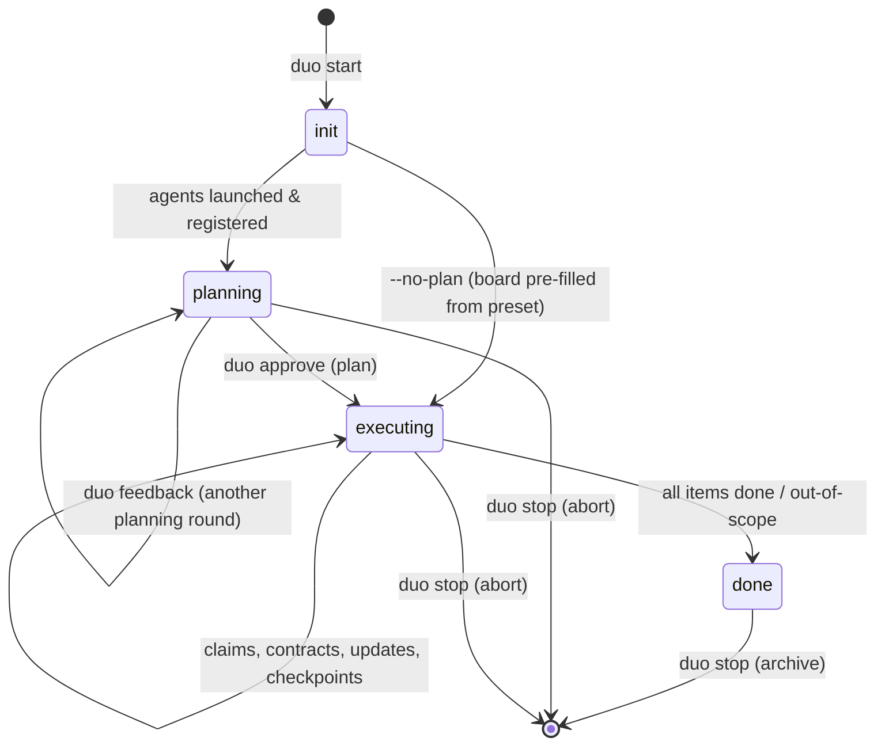

# Concept: Session Lifecycle

## What it is

A session is one collaborative run: one goal, one set of agents, one board, one outcome. The hub
owns its state machine; every tool and command is defined relative to the current phase.

## The phases



## Phase by phase

### 1. `init` — orchestration setup (seconds, no agent tokens)

`duo start "goal"`: load config → scan workspaces ([project-scanner.md](project-scanner.md)) →
spawn/reuse hub → write MCP configs → build kickoff prompts (role brief + workspace binding +
project map + protocol instructions) → adapters launch agents. The **registration handshake**
(each agent calls `register_agent`; generalizes gen 1's arming) confirms every agent is alive
and MCP-attached before the session proceeds — a failed registration fails the start loudly.

### 2. `planning` — agents author the board (minutes)

Explore → `post_plan` → hub merges → agents block on `await_plan_approval` → human reviews
(`duo plan`) and approves/edits/feeds back. Detail: [planning-phase.md](planning-phase.md).
Skipped entirely by `--no-plan`.

### 3. `executing` — the long phase

Agents loop: `get_board` (deltas) → `claim_task` → work → `post_contract` when shapes are
decided → `post_update` at milestones → `complete_task` with refs. Checkpoint mode inserts
pauses ([checkpoints.md](checkpoints.md)). The human watches `duo status --watch` or the
dashboard and resolves checkpoints as they arrive.

### 4. `done` — gated completion

The hub flips to `done` only when **every board item is `done` or human-marked
`out-of-scope`** — an agent merely *believing* it's finished doesn't end the session. The
kickoff's gap-sweep instruction (re-read board + goal before declaring done, post anything
missing) is the last net against dropped work.

### 5. `stop` — teardown

`duo stop`: adapters terminate agent processes, hub archives `~/.duo/session.json` →
`~/.duo/history/<timestamp>.json`, hub exits. `--clean` also removes written workspace files
(MCP configs, rules, TASKS.md). Contracts mirrors are left in place deliberately — they're
project documentation.

## Cross-phase rules

| Rule | Enforced by |
|---|---|
| Tools called out of phase return `{ phase, message }`, never block | hub |
| One session per machine (v1) | CLI (`duo start` refuses if a session is active) |
| Agent process spans planning + execution | adapters ([02-architecture-upgrade/07-long-lived-sessions.md](../02-architecture-upgrade/07-long-lived-sessions.md)) |
| Crash ⇒ claimed items reopen, resume via brief | hub + CLI ([resume-system.md](resume-system.md)) |
| Every phase transition emits an SSE event | hub → CLI watch / dashboard |

## Example: a full session transcript (condensed)

```
$ duo start "Add Google OAuth login"
  hub :3131 ✓   scan web(212 lines) api(187 lines) ✓
  Agent A cursor-cli … registered ✓     Agent B claude-code … registered ✓
  phase: planning — waiting for proposals
  Agent A posted plan (2 items)   Agent B posted plan (4 items)
  merged: 5 items (1 unassigned) — run `duo plan`
$ duo plan                     # review
$ duo approve --assign t5=B    # phase: executing
  [A] claimed t1 …  [B] claimed t2 …
  [B] 📋 contract auth-api rev1
  [B] ⏸ checkpoint: migration next
$ duo approve
  …
  board complete (5/5) — phase: done
$ duo stop
  session archived: ~/.duo/history/2026-07-10T15-42.json
```
